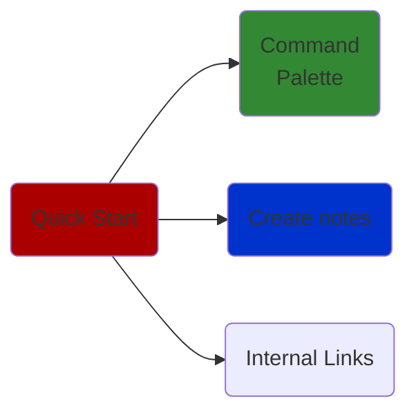

# Shorthand of everything Cheat Sheet
---
> [!info]+ Module Details
> Includes information about (genus:: Cheat Sheet), link to CS module and it's correspondent attribute tag 
> *Module Tag :* 
> *Link :* 
> *Cheat Sheet tag :* [[Grail 🩷]]
> 

---
### Equations and phrases
**Structure :** (Topic) Phrase
#### Phrases

#### Equations

---
### Topics

```mermaid
graph TD

Paradigms --> Imperative
Paradigms --> Declarative

Declarative --> "/Low_Level, Scientific, Commerical"


Imperative --> List_Processing
Imperative --> Logical
Imperative --> Funtional


class Declarative,Imperative internal-link;
```



### Imperative Programming

Imperative programming focuses on how a program operates. It involves giving the computer a sequence of instructions to follow, detailing each step required to achieve a desired outcome. This paradigm is often easier for beginners to grasp because it mirrors the way computers execute commands sequentially.

For example, consider filtering a list of passwords to include only those with nine or more characters:

```js
const passwords = ["123456", "password", "admin", "freecodecamp", "mypassword123"];
let longPasswords = [];
for (let i = 0; i < passwords.length; i++) {
	const password = passwords[i];
	if (password.length >= 9) {
	longPasswords.push(password);
	}
}
console.log(longPasswords); // logs ["freecodecamp", "mypassword123"]
```
In this example, the code explicitly describes each step: creating an empty list, iterating through the passwords, checking their length, and adding the valid ones to the new list.

### Declarative Programming

Declarative programming, on the other hand, focuses on what the program should accomplish without specifying the steps to achieve it. This paradigm allows for more readable and concise code, as it abstracts the control flow and focuses on the desired outcome.

Using the same example, a declarative approach in JavaScript would be:

```js
const passwords = ["123456", "password", "admin", "freecodecamp", "mypassword123"];
const longPasswords = passwords.filter(password => password.length >= 9);
console.log(longPasswords); // logs ["freecodecamp", "mypassword123"]
```
Here, the code declares the intention to filter the list of passwords, leaving the implementation details to the filter method.

---
#TODO Need to include reference vs value, look at test prep lec
[[Grail 🩷]]

Agglomerative clustering: • Bottom-up hierarchy • Linkage • Few datapoints/Accurate comparison Divisive Clustering: • Top-down hierarchy • Many datapoints/Rough comparison DBSCAN: • Density-based • Non-convex