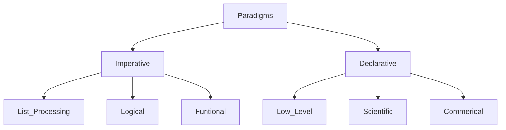

# Shorthand of everything Cheat Sheet
---
> [!info]+ Module Details
> Includes information about (genus:: Cheat Sheet), link to CS module and it's correspondent attribute tag 
> *Module Tag :* 
> *Link :* 
> *Cheat Sheet tag :* [[Grail 🩷]]
> 

---
### Equations and phrases
**Structure :** (Topic) Phrase
#### Phrases

#### Equations

---
### Topics

---
#TODO
[[Grail 🩷]]